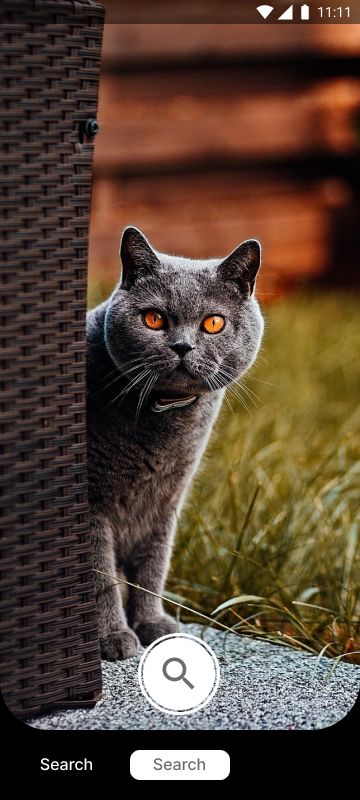

ImageRecognition
===================

### Computer vision module for image similarity

A module of a mobile application for analyzing the image of an animal and searching for it among 
similar images in order to develop a functional to help volunteers

### Architecture 
* [Kotlin](https://kotlinlang.org/) 
* [MVI](https://medium.com/quality-content/mvi-a-reactive-architecture-pattern-45c6f5096ab7)
* [Coroutines](https://kotlinlang.org/docs/coroutines-basics.html)
* [Compose](https://developer.android.com/jetpack/compose)

### Preview

